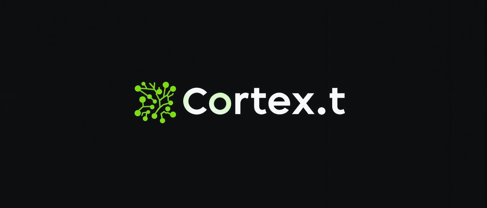

## Overview


```
Cortex.t stands at the forefront of artificial intelligence, offering a dual-purpose solution that caters to the needs of app developers and innovators in the AI space. This platform is meticulously designed to deliver reliable, high-quality text and image responses through API usage, utilising the decentralised Bittensor network. It serves as a cornerstone for creating a fair, transparent, and manipulation-free environment for the incentivised production of intelligence (mining) and generation and fulfilment of diverse user prompts.
```

## Documentation

- Validating: [VALIDATOR.md](docs/VALIDATOR.md)
- Reward Explanation: [REWARD_EXPLAINATION.md](docs/REWARD_EXPLAINATION.md)
- Mining: [MINER.md](docs/MINER.md)
