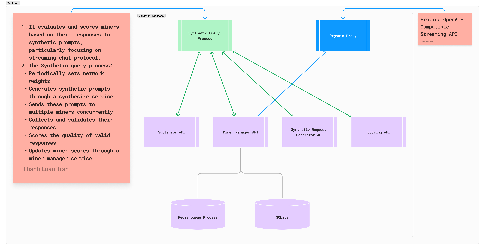

# Validator Setup



**Minimum Requirements**
- CPU Virtual Machine
- OpenAI API Key at https://platform.openai.com/
- Together API Key at https://www.together.ai/

## Step-by-step setup

1. Install repository:
```
git clone https://github.com/corcel-api/cortex.t
cd cortex.t
pip install uv
uv venv
. .venv/bin/activate
uv sync
```

2. Configure env variables:
```
export SUBTENSOR_NETWORK=finney
export SUBTENSOR_NETUID=18
export WALLET_NAME=default
export WALLET_HOTKEY=default
export AXON_PORT=8000
export OPENAI_API_KEY=your_openai_api_key
export TOGETHER_API_KEY=your_together_api_key
```

To verify the exported variables:
```
python -m cortext
```

3. Spin up necessary services:

| Service | Default Port | Environment Variable | Process Command |
|---------|-------------|---------------------|-----------------|
| Redis | 6379 | `REDIS_PORT` & `REDIS__PORT` | `. scripts/install_redis.sh` |
| Subtensor Sync | 8104 | `W_SUBTENSOR__PORT` | `pm2 start python --name "cortex_w_subtensor" -- -m services.subtensor_syncing.server` |
| Scoring | 8101 | `SCORE__PORT` | `pm2 start python --name "cortex_scoring" -- -m services.scoring.server` |
| Synthesizing | 8102 | `SYNTHESIZE__PORT` | `pm2 start python --name "cortex_synthesizing" -- -m services.synthesizing.server` |
| Managing | 8103 | `MINER_MANAGER__PORT` | `pm2 start python --name "cortex_managing" -- -m services.managing.server` |
| Synthesizing Worker | N/A | N/A | `pm2 start python --name "cortex_synthesizing_worker" -- -m services.synthesizing.refill_worker` |

You can modify the default ports by setting the corresponding environment variables before starting the services.

4. Run main validating proccess:
```
pm2 start python --name "cortex_validating" -- -m neurons.validator
```


### Default Config
```
{
    'redis': {
        'host': 'localhost',
        'port': 6379,
        'db': 0,
        'organic_queue_key': 'organic_queue',
        'synthetic_queue_key': 'synthetic_queue',
        'miner_manager_key': 'node_manager'
    },
    'bandwidth': {
        'interval': 60,
        'min_stake': 10000,
        'model_configs': {
            'gpt-4o': {
                'credit': 1,
                'model': 'gpt-4o',
                'max_tokens': 8096,
                'synapse_type': 'streaming-chat',
                'timeout': 12,
                'allowed_params': ['messages', 'temperature', 'max_tokens', 'stream', 'model', 'seed']
            },
            'dall-e-3': {
                'credit': 1,
                'model': 'dall-e-3',
                'max_tokens': 1024,
                'synapse_type': 'streaming-chat',
                'timeout': 32,
                'allowed_params': ['prompt', 'n', 'size', 'response_format', 'user']
            },
            'claude-3-5-sonnet-20241022': {
                'credit': 1,
                'model': 'claude-3-5-sonnet-20241022',
                'max_tokens': 8096,
                'synapse_type': 'streaming-chat',
                'timeout': 12,
                'allowed_params': ['messages', 'temperature', 'max_tokens', 'stream', 'model']
            }
        },
        'min_credit': 128,
        'max_credit': 1024
    },
    'score': {'decay_factor': 0.9, 'host': 'localhost', 'port': 8101},
    'sql': {'url': 'sqlite:///miner_metadata.db'},
    'network': 'mainnet',
    'synthesize': {'host': 'localhost', 'port': 8102, 'synthetic_pool_size': 1024, 'organic_pool_size': 1024},
    'miner_manager': {'port': 8103, 'host': 'localhost'},
    'validating': {'synthetic_threshold': 0.2, 'synthetic_batch_size': 4, 'synthetic_concurrent_batches': 1},
    'w_subtensor': {'host': 'localhost', 'port': 8104},
    'organic': {'host': 'localhost', 'port': 8105},
    'subtensor_network': 'test',
    'subtensor_netuid': 245,
    'wallet_name': 'tnv',
    'wallet_hotkey': '0',
    'subtensor_tempo': 360,
    'axon_port': 8000
}
```